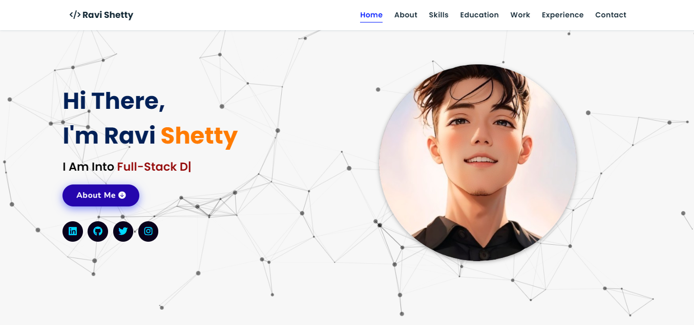

# 🌐 Portfolio Website

A personal portfolio website built to showcase my projects, skills, achievements, and resume. Built using modern web technologies with a responsive layout optimized for both desktop and mobile views.

## 🚀 Live Demo

👉 [Visit My Portfolio](https://ravishetty-portfolio.netlify.app/)

## 📸 Screenshots




## 🛠️ Tech Stack

- **HTML5**
- **CSS3**
- **JavaScript**
- **Bootstrap / Tailwind CSS** 
- **GSAP 

## 📁 Folder Structure

```

📁 portfolio/
├── 📁 assets/
│   └── 📄 images, icons, fonts...
├── 📁 css/
│   └── styles.css
├── 📁 js/
│   └── main.js
├── 📄 index.html
├── 📄 about.html
├── 📄 projects.html
└── 📄 contact.html

```

## ✨ Features

- Responsive design for all screen sizes
- Smooth scrolling and page animations
- Project showcase with links to GitHub
- Downloadable resume
- Contact form (optional backend integration)
- Dark/light mode toggle (if applicable)

## 📌 Sections

- **Home** – Introduction and tagline
- **About** – Skills, experience, and background
- **Projects** – Portfolio of key projects with links
- **Resume** – Downloadable CV
- **Contact** – Reach out via email or form

## 🧑‍💻 Author

**Ravi Shetty**  
📧 [ravishetty05082@example.com]  
🌐 [LinkedIn](https://www.linkedin.com/in/ravi-m-shetty/) • [GitHub](https://github.com/Ravishetty07)


